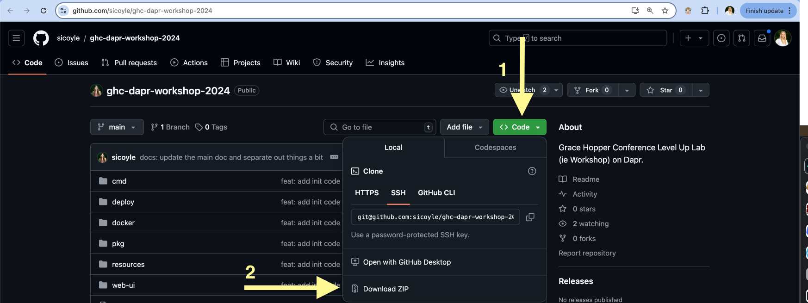

# Prerequisites

- [Install necessary software](#install-necessary-software)
- [Download the code](#download-the-code)

## Install necessary software
1. [Install the Dapr Command Line Interface (CLI)](https://docs.dapr.io/getting-started/install-dapr-cli/)
2. [Download Go](https://go.dev/doc/install)
3. [Install Docker](https://docs.docker.com/engine/install/)
4. [Initialize Dapr](#initialize-dapr)
5. Optional to use the User Interface: [Install node & npm](https://docs.npmjs.com/downloading-and-installing-node-js-and-npm)
6. Optional to [install an IDE, such as VSCode](https://code.visualstudio.com/download)


## Download the code

There are many ways to download the code to interact with this Level Up Lab.
Use either flow that applies to you:
- [You have a preexisting Github account](#if-you-have-a-github-account)
- [You do not have a Github account](#if-you-do-not-have-a-github-account)

### If you have a Github account
1. Clone the repository:
```
git clone git@github.com:sicoyle/ghc-dapr-workshop-2024.git
```
2. Enter the directory where the code is located either in your Finder app, or IDE, or in terminal with:
```
cd ghc-dapr-workshop-2024
```

### If you do NOT have a Github account

1. Access the code by downloading a ZIP file containing the Github repository if you do not have a Github account.


2. Unzip the download.

2. Enter the directory where the code is located either in your Finder app, or IDE, or in terminal with:
```
cd ghc-dapr-workshop-2024
```

## Initialize Dapr

[Initialize Dapr in your local development environment](https://docs.dapr.io/getting-started/install-dapr-selfhost/)

```shell
dapr init
```

Note, a `dapr init` includes:
- Running a Redis container instance to be used as a local state store and message broker.
- Running a Zipkin container instance for observability.
- Creating a default components folder with component definitions for the above.
- Running a Dapr placement service container instance for local actor support.
- Running a Dapr scheduler service container instance for job scheduling.

Ensure dapr was successfully installed by seeing this output:

```shell
dapr init           
⌛  Making the jump to hyperspace...
ℹ️  Container images will be pulled from Docker Hub
ℹ️  Installing runtime version 1.14.4
↖  Downloading binaries and setting up components...
Dapr runtime installed to /Users/cassie/.dapr/bin, you may run the following to add it to your path if you want to run daprd directly:
    export PATH=$PATH:/Users/cassie/.dapr/bin
✅  Downloading binaries and setting up components...
✅  Downloaded binaries and completed components set up.
ℹ️  daprd binary has been installed to /Users/cassie/.dapr/bin.
ℹ️  dapr_placement container is running.
ℹ️  dapr_redis container is running.
ℹ️  dapr_zipkin container is running.
ℹ️  dapr_scheduler container is running.
ℹ️  Use `docker ps` to check running containers.
✅  Success! Dapr is up and running. To get started, go here: https://docs.dapr.io/getting-started
```

With dapr successfully installed, check in the Dockerhub UI to see the following running containers:
- dapr_scheduler
- dapr_placement
- dapr_redis
- dapr_zipkin
  

Use the following command to see the containers running via the terminal:

```shell
docker ps -a
CONTAINER ID   IMAGE                           COMMAND                  CREATED         STATUS                   PORTS                                                                                                 NAMES
db750d86480e   daprio/dapr:1.14.4              "./scheduler --etcd-…"   2 minutes ago   Up 2 minutes             0.0.0.0:50006->50006/tcp, 0.0.0.0:52379->2379/tcp, 0.0.0.0:58081->8080/tcp, 0.0.0.0:59091->9090/tcp   dapr_scheduler
3905d0dd21f8   daprio/dapr:1.14.4              "./placement"            2 minutes ago   Up 2 minutes             0.0.0.0:50005->50005/tcp, 0.0.0.0:58080->8080/tcp, 0.0.0.0:59090->9090/tcp                            dapr_placement
49db629fa223   redis:6                         "docker-entrypoint.s…"   2 minutes ago   Up 2 minutes             0.0.0.0:6379->6379/tcp                                                                                dapr_redis
95f598b3b9cb   openzipkin/zipkin               "start-zipkin"           2 minutes ago   Up 2 minutes (healthy)   9410/tcp, 0.0.0.0:9411->9411/tcp                                                                      dapr_zipkin
```